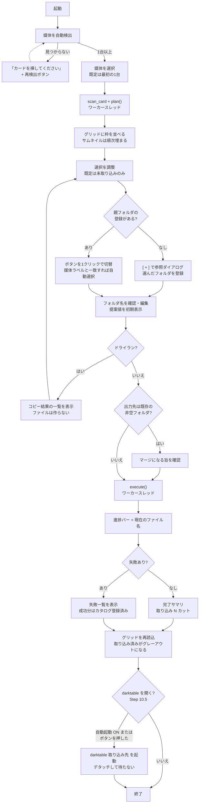

# Importer（Phase 1）計画書

- **ステータス**: ✅ 完了 — Importer が CLI / GUI で動作し、実機カード（355 カット）で
  受け入れテスト 15 項目を通過。自動テスト 156 件 green。カタログスキーマを確定した
- **実施者**: AI エージェント（Claude Opus 5）+ ユーザー
- **開始日**: 2026-08-08 / **完了日**: —
- **対象 Phase**: architecture.md §10 Phase 1（Importer 単体）
- **関連ドキュメント**: [architecture.md](../architecture.md) §5 / §9、[agent_execution_rules.md](../agent_execution_rules.md)

## 1. 背景と目的

Lightroom の取り込み工程を置き換える。SD カードから `D:\写真\<機種>\<YYYYMMDD 撮影名>\` へ、
**リネーム・重複判定・コピー検証**を伴って取り込むツールを作る。

Phase 1 は darktable への依存がゼロで単体完結する。ここで
**カタログスキーマと重複判定キーを固める**ことが後続 Phase の前提になる。

### 完了条件

1. 実機の SD カード（Z6 / Z50）から、リネーム済みの NEF / JPG / MOV を
   指定フォルダへ取り込める（GUI 操作）
2. 同じカードを 2 回取り込もうとしたとき、2 回目は取り込み済みとして識別される
3. コピー後のハッシュ照合に成功し、破損コピーが検出できる
4. `%LOCALAPPDATA%\Photolab\catalog.db` にスキーマが確定した状態で記録される

### ベースライン（現状の手作業）

現在は Lightroom またはエクスプローラでの手動コピー + 手動リネーム。
取り込み済み判定は人間の記憶に依存しており、二重取り込みと取り込み漏れが実際に発生している。

## 2. スコープと設計判断

### 2.1 変更すること

新規作成のみ。既存ファイルの変更は `doc/architecture.md`（決定事項の反映）に限る。

```
photolab/
  __init__.py
  __main__.py            エントリポイント（GUI 起動 / CLI サブコマンド）
  core/                  ★ PySide6 を import しない層
    metadata.py          EXIF / MakerNote 抽出（serial, shutter_count, captured_at）
    dedup.py             重複判定キー生成（architecture §5.3）
    naming.py            YYYYMMDD-hhmmss_NN 命名・秒内連番の採番
    scanner.py           媒体検出、カード走査、除外ファイル判定、カット単位のグルーピング
    copier.py            コピー + xxh3 照合
    catalog.py           sqlite3 カタログ（スキーマ / マイグレーション / 問い合わせ）
    thumbnail.py         rawpy による埋め込み JPEG 抽出とキャッシュ
    importer.py          取り込みオーケストレーション（ドライラン対応）
    config.py            config.toml の読み書き
  ui/                    PySide6 層
    main_window.py
    thumbnail_grid.py
    import_worker.py     QThread ワーカー
tests/                   core/ と 1:1 ミラー
tmp/                     一時・調査スクリプト、ダミーデータ
```

### 2.2 変更しないこと（確定した設計判断）

architecture.md §7 の判断をすべて引き継ぐ。本計画で追加する判断:

| 論点 | 判断 | 理由 |
| :--- | :--- | :--- |
| GUI を先に作る | **やらない**。CLI で end-to-end を通してから GUI を載せる | ドメインロジックのテスト可能性を先に確保する。GUI 先行だとロジックが UI に染み出す |
| 取り込み後にカード上のファイルを削除する | **やらない** | 削除はカメラでのフォーマットに任せる。ツールが原本を消す動線を作らない |
| 取り込み中断時のロールバック（コピー済みファイルの削除） | **やらない**。`import_batch.status = aborted` を記録するに留める | 出力先の削除処理を持たせない。中途半端なファイルは次回の重複判定で識別できる |
| Windows AutoPlay 連携 | **やらない** | architecture.md §5.1 の通り Linux 移管時に捨てる資産になる |
| 既存 18,909 枚の遡及登録 | **やらない** | architecture.md §7 の通り |
| 常駐プロセスによる自動起動 | **やらない**（Phase 1.5 へ切り出し） | Q4 合意。Phase 1 は手動起動 + 起動時の自動媒体検出まで |
| `pyexiv2` を製品コードで使う | **やらない** | GPL-3.0（下層の exiv2 も GPL-2.0）。Q8 のライセンス方針に反する。開発時の答え合わせ用途に限り使う |
| 取り込み履歴を複数レコードで持つ | **やらない**。1 dedup_key : 1 レコードで `dest_path` を更新する | Q3 合意。カタログが答えるのは「取り込み済みか」の1問だけ（architecture.md §3.3） |
| 独立した `doc/importer_spec.md` を作る | **やらない**（当面）。**architecture.md §5 を育てる** | source of truth を増やさない。§5 が既に仕様の置き場所であり、新設すると計画書 §3 と合わせて記述が3箇所に分散する。§5 が肥大して「全体を掴む」役割を壊し始めたら、そのとき分離して §5 からリンクする |

## 3. 変更内容

### 3.1 メタデータ抽出（`core/metadata.py`）

- **何を**: NEF / JPG / MOV から `camera_model` / `camera_serial` / `shutter_count` / `captured_at` を取得する
- **なぜ**: 重複判定キー（§5.3）と命名規則（§5.2）の両方がこれに依存する
- **影響範囲**: **取得可否が本計画全体の前提**。Step 1 のスパイクで確定させ、
  失敗した場合は §4-Q1 の退避方針に従って dedup.py / catalog.py の設計を変える

抽出バックエンドは差し替え可能なインターフェースにする。**ライセンス方針（Q8）により
`pyexiv2` は製品コードから外し**、以下の構成にする。

| 優先 | 手段 | ライセンス | 備考 |
| :--- | :--- | :--- | :--- |
| 1 | **自前の最小 TIFF/EXIF パーサ** | 自作 | NEF は TIFF ベース。必要なのは 4 フィールドのみ。Nikon MakerNote の `0x001d` SerialNumber / `0x00a7` ShutterCount は平文 |
| 2 | `exiftool` の外部プロセス呼び出し | Artistic/GPL だが**別プロセス**のため汚染しない | 未インストール。使うなら同梱せずユーザー環境に委ねる |
| — | `pyexiv2` | GPL-3.0 | **製品コードでは使わない**。Step 1 で自前パーサの出力を突き合わせる基準としてのみ使用 |

退避キー（Q1）を使ったカットは `imported_media` に記録した上で、**GUI で警告表示する**。

### 3.2 命名（`core/naming.py`）

`YYYYMMDD-hhmmss_NN.<拡張子>`。`NN` は秒内連番（2桁、01 始まり）。

- 同一「カット」（RAW + JPEG ペア）は同じ basename を共有する
- **採番範囲**: 今回取り込むファイル群に加え、**出力先フォルダの既存ファイルも走査**して衝突を避ける（Q2 合意）。
  同じ撮影フォルダへ複数回・複数カードから追加取り込みする運用が実在するため
- **採番順序**: ショットカウント昇順 → 取れなければ元ファイル名昇順（Q2 合意）
- **旧形式との関係**: 既存資産には `YYYYMMDD-hhmmssNNN`（3桁・アンダースコアなし）が実在するが、
  実測の結果 **`NNN` はフォルダ内で一定であり秒内連番ではなかった**（§7）。
  アンダースコアの有無で文字列衝突しないため、旧形式は `NN` の消費対象に含めない。
  走査は `^\d{8}-\d{6}_(\d{2})` に一致するものだけを使用済み連番として数える
- **走査範囲は出力先フォルダ直下のみ**。`darktable\` サブフォルダは再帰的に見ない（現像後の書き出し先のため）
- **`NN` は 2桁固定**。99 を超えたら例外を送出して停止する（秒間 100 コマのカメラは存在しないため、
  到達したらバグかメタデータ異常とみなす）

### 3.3 カタログ（`core/catalog.py`）

architecture.md §9 のスキーマを実装する。追加で `schema_version` テーブルを持ち、
将来のマイグレーションに備える（Phase 2 でスキーマ拡張が入るため）。

`imported_media.dedup_key` の UNIQUE 制約が二重取り込み防止の最終防衛線になる。

再取り込み（Q3 合意）は **UPSERT** で扱う。同じ `dedup_key` が来たら新レコードを追加せず、
`dest_path` / `dest_name` / `import_batch_id` を最新の取り込み先で上書きする。
`dest_path` は「どこへ入れたか」の参考情報であり、**正確な追跡は保証しない**
（媒体は取り込み後に消す運用のため、重要なのは「取り込んだか」の一点）。

### 3.4 コピー検証（`core/copier.py`）

読み出しながら xxh3 を計算 → 書き込み → 書き込んだファイルを読み直して再計算 → 照合。
不一致ならそのファイルを失敗として記録し、**カタログには登録しない**。

### 3.5 取り込みオーケストレーション（`core/importer.py`）

`plan()` と `execute()` を分ける。`plan()` は副作用なしで
「どのファイルがどの名前でどこへ行くか / どれが取り込み済みか」を返す。
GUI のプレビューと CLI のドライランが同じ関数を使う。

### 3.6 GUI 構成（Step 10 / **レビュー待ち**）

実装規約は `.claude/skills/photolab-gui/SKILL.md`（GUI を触るセッションが自動で読む）。

#### 画面構成: 1 ウィンドウ・上から下へ進む

ウィザード形式（複数画面）にはしない。**やり直しが多い操作**（サムネイルを見てから
出力先を決め直す、選択を変える）のため、全部が同時に見えている方がよい。

```
┌────────────────────────────────────────────────────────────────┐
│ Photolab                                              [_][□][×]│
├────────────────────────────────────────────────────────────────┤
│ 媒体  [ NIKON Z 6 (L:\)              ▼ ]  [再検出]              │  ← ①
│       355 カット / 未取り込み 355 / 取り込み済み 0               │
├────────────────────────────────────────────────────────────────┤
│ ┌────┐┌────┐┌────┐┌────┐┌────┐┌────┐  ▲│
│ │ ☑ ││ ☑ ││ ☑ ││ ☑!││ ☑ ││ ☑ │   │  ← ②
│ │IMG ││IMG ││IMG ││🎬  ││IMG ││IMG │   │
│ └────┘└────┘└────┘└────┘└────┘└────┘   │
│ ┌━━━━┓┏━━━━┓┏━━━━┐┌────┐┌────┐┌────┐   │
│ ┃ ☐ ┃┃ ☐ ┃┃ ☑ ┃│ ☑ ││ ☑ ││ ☑ │   │
│ ┃灰色┃┃灰色┃┃IMG ┃│IMG ││IMG ││IMG │  ▼│
│ └━━━━┛┗━━━━┛┗━━━━┘└────┘└────┘└────┘    │
│  ↑取り込み済み(グレーアウト)  ↑太枠=Shift でまとめて選択中      │
├────────────────────────────────────────────────────────────────┤
│ [すべて選択] [すべて解除] [未取り込みのみ]  取り込む 353 カット  │  ← ③
├────────────────────────────────────────────────────────────────┤
│ 出力先  ┌────┐┌─────┐┌───┐                                    │  ← ④
│         │ Z6 ││ Z50 ││ + │   D:\写真\Z6                        │
│         └━━━━┘└─────┘└───┘                                    │
│         名 [ 20260810 テスト               ]                    │
│         → D:\写真\Z6\20260810 テスト\  (新規作成)               │
├────────────────────────────────────────────────────────────────┤
│ ⚠ 1 カットが弱いキーで判定されています                          │  ← ⑤
│ [████████████░░░░░░░░]  213/353  20260806-201222_01             │
│                                    [ドライラン] [取り込み開始]  │
└────────────────────────────────────────────────────────────────┘
```

| | 領域 | 中身 |
| :--- | :--- | :--- |
| ① | 媒体選択 | `find_media()` の結果。ラベルに機種名が入る |
| ② | サムネイルグリッド | `QListView` IconMode。取り込み済みはグレーアウト、弱いキーは `!` |
| ③ | 選択操作 | 既定は「未取り込みのみ」（Q3 合意） |
| ④ | 出力先 | **登録した親フォルダを1クリックで切替**。フォルダ名は提案 + 編集可 |
| ⑤ | 警告・進捗・実行 | 警告は常時表示。進捗はワーカーからのシグナル |

#### ④ 出力先の親フォルダは登録制にする

毎回フォルダ参照ダイアログを開くと、関係ないフォルダの中から探すことになり手間。
**よく使う親フォルダを登録しておき、1クリックで切り替える。**

- 初期状態は登録ゼロ。`[ + ]` だけが出る
- `[ + ]` で参照ダイアログを開き、選んだフォルダを登録する（例: `D:\写真\Z6`）
- 次の取り込みで `D:\写真\Z50` を登録すると `[Z6] [Z50] [ + ]` になる
- **ボタンのラベルはフォルダ名の末尾**（`D:\写真\Z6` → `Z6`）。
  同名が衝突する場合は1つ上の階層まで含める（`写真\Z6`）
- 右クリックで「削除」「名前を変更」。**登録の削除は実フォルダを消さない**
- 選択中の親はフルパスを右に表示する（どこを指しているか常に見える）
- 媒体のボリュームラベル（`NIKON Z 6`）と一致する登録があれば**自動で選ぶ**

登録内容は `config.toml` に保存する（下記）。

#### ② サムネイルの選択方式

**チェックボックス（取り込む/取り込まない）と、Qt の選択（操作対象）を分ける。**

| 操作 | 動作 |
| :--- | :--- |
| クリック | そのカットを選択（他の選択は解除）。**チェック状態は変わらない** |
| **Shift + クリック** | 直前に選んだカットからクリックしたカットまでを**範囲選択** |
| Ctrl + クリック | 選択に1つ追加／除外 |
| Ctrl + A | すべて選択 |
| チェックボックスをクリック | そのチェックを反転。**複数選択中なら選択中すべてに適用** |
| Space キー | 選択中すべてのチェックを反転 |
| `[すべて選択]` / `[すべて解除]` | 全カットのチェックを一括で on / off |
| `[未取り込みのみ]` | 未取り込みだけチェック（**起動時の既定状態**） |

**なぜ分けるか**: 「選択 = 取り込む」にすると、1枚クリックして拡大確認しただけで
それまでの選択が全部消える。既定の「未取り込みのみ」という状態も1クリックで壊れる。
チェックは残り、選択は自由に動かせる方が写真の取り込みには合う。

`③` のカウントは**チェック数**（＝実際に取り込む数）を出す。

#### ファイル構成

```
photolab/ui/
  app.py             QApplication の生成、フォント設定、main()
  main_window.py     上記レイアウトの組み立てとシグナル配線
  shot_model.py      QAbstractListModel（ImportPlan を包む。チェック状態を持つ）
  dest_bar.py        親フォルダの登録バー（④）
  thumbnail_loader.py サムネイル生成ワーカー（読み出し直列・縮小並列）
  import_worker.py   取り込みワーカー（plan / execute を呼ぶ）
```

#### `config.toml`（Step 11 の一部を Step 10 に前倒し）

親フォルダの登録を永続化するため、設定の読み書きが Step 10 で必要になる。

```toml
# %LOCALAPPDATA%\Photolab\config.toml
last_dest_root = 'D:\写真\Z6'

[[dest_roots]]
label = "Z6"
path = 'D:\写真\Z6'

[[dest_roots]]
label = "Z50"
path = 'D:\写真\Z50'

[window]
width = 1200
height = 800

[darktable]                                            # Step 10.5
executable = 'C:\Program Files\darktable\bin\darktable.exe'
launch_after_import = false
```

読みは標準の `tomllib`（Python 3.12 に同梱）。書きは**この程度のスキーマなら
手書きのシリアライザで足りる**ため、TOML 書き出しの依存は追加しない。
パスは Windows の `\` をそのまま扱えるようリテラル文字列（`'...'`）で書く。

#### 操作フロー



#### 実装順序（Step 10 の内訳）

1. `ui/app.py` + `ui/main_window.py` の骨格 — 空ウィンドウが出るところまで
2. 媒体選択（①）— `find_media()` を繋ぐ。**ここで手動起動が成立する**
3. `ui/shot_model.py` + グリッド（②）— サムネイルなしで枠だけ並べる
4. `ui/thumbnail_loader.py` — サムネイルを順次流し込む
5. 選択操作（③）— チェック方式、Shift 範囲選択、全選択/全解除
6. `core/config.py` の読み書き + `ui/dest_bar.py`（④）— 親フォルダの登録
7. `ui/import_worker.py` + 進捗・警告・完了サマリ（⑤）
8. 実機カードで通し確認（出力先は `tmp/`）

各段階で動く状態を保つ。2 の時点で「カードを検出できる GUI」として起動できる。

## 4. ユーザー確認事項

**着手前にここを合意する。** 括弧内はエージェントの推奨案。
`**REV**` はユーザーの回答、`**決定**` は反映後の確定内容。

| | 論点 | 状態 |
| :--- | :--- | :--- |
| Q1 | 退避キーの具体形 | ✅ 合意 |
| Q2 | 秒内連番の採番範囲 | ✅ 合意 |
| Q3 | 取り込み済みカットの扱い | ✅ 合意 |
| Q4 | 常駐プロセスの自動起動 | ✅ 合意（Phase 1.5 へ） |
| Q5 | git 初期化 | ✅ 合意（リモート提供済み） |
| Q6 | フィクスチャの置き場所 | ✅ 合意（`data/test/`） |
| Q7 | MOV の撮影日時取得元 | ✅ 合意（自前 `mvhd` パース） |
| Q8 | ライセンス方針（GPL 回避） | ✅ 合意（自前パーサ / `pyexiv2` は検証用のみ） |

**全項目合意済み。以降の設計変更はここではなく §7 に理由付きで記録する。**

### Q1. MakerNote が取得できなかった場合の退避キー

architecture.md §5.3 は「取得できなかった場合は撮影日時ベースのキーに退避する」としているが、
具体形が未定。**推奨: 動画と同じ `t:{captured_at}:{source_name}:{size}` に揃える。**

ただしこの退避キーは弱い（カードをフォーマットするとカメラが `DSC_0001` から振り直すため、
別カットが同名・同秒・同サイズになる可能性がゼロではない）。
**退避キーを使った場合は GUI に警告を出す**方針でよいか。
**REV** Yes

**決定**: 退避キーは `t:{captured_at}:{source_name}:{size}`。使用時は GUI に警告を出す。→ §3.1 に反映

### Q2. 秒内連番 `NN` の採番範囲

同じ秒に撮られた複数カットへの 01, 02... の振り方。

- **採番範囲**: (a) 今回取り込むファイル群の中だけで採番 / (b) 出力先フォルダの既存ファイルも走査して衝突を避けて採番
  → **推奨: (b)**。同じ撮影フォルダへ複数回・複数カードから追加取り込みする運用が実在するため（architecture.md §4.1）
- **採番順序**: **推奨: ショットカウント昇順 → 取れなければ元ファイル名昇順**

**REV** Yes

**決定**: (b) 出力先の既存ファイルも走査。順序はショットカウント昇順。→ §3.2 に反映

**追加確認（既存資産の命名形式）**: 走査対象の既存ファイルに
`20191001-091654002.JPG` という**旧形式（3桁・アンダースコアなし）**が実在することが判明した。

> **REV** 二桁連番でいいよ。秒間 99枚は撮れるカメラは存在しないし。

**決定**: 新規則は `_NN`（**2桁固定**）。旧形式はアンダースコアの有無で文字列衝突しないが、
`naming.py` は**両形式を認識して**同一秒の使用済み連番として数える。
99 を超えた場合は**エラーで停止する**（黙って上書きしない）。→ §3.2 に反映

### Q3. 取り込み済みカットの既定の扱い

サムネイルグリッドでグレーアウトすることは決定済み（§5.1）。
**推奨: 既定で選択解除。ユーザーが明示的にチェックすれば再取り込みできる**
（別フォルダへ意図的にコピーしたいケースがあるため）。
再取り込み時は `dedup_key` が UNIQUE で衝突するので、`imported_media` は
1 dedup_key : 1 レコードのまま `dest_path` を更新するか、履歴を持たせるか要判断。
**推奨: 更新（カタログは台帳ではない、architecture.md §3.3）。**

**REV** dedup_key は取り込み済みかどうか？　だけでなく、コピー先のパスもトレースするのね。  
        メディアのデータは取り込み終わったら基本消す方が多いので、取り込んだかどうかが重要なので、コピー先はあまり気にしてないので更新でいいかな。

**決定**: 既定で選択解除・明示チェックで再取り込み可。カタログは UPSERT で `dest_path` を上書きし、
履歴は持たない。`dest_path` は参考情報であり正確な追跡は保証しない。→ §2.2 / §3.3 に反映


### Q4. 常駐プロセスによる自動起動を Phase 1 に含めるか

architecture.md §11 の未決事項。
**推奨: 含めない（Phase 1.5 に切り出す）。** Phase 1 は手動起動 + 起動時の自動媒体検出まで。

**REV** Yes

**決定**: Phase 1.5 へ切り出し。→ §2.2 / §8 に反映。architecture.md §11 の未決事項も解消する

### Q5. git の初期化

現在 git 未初期化。コード作成前に初期化したい。
**`git init` をエージェントが実行してよいか**（`.gitignore` は `venv/` `tmp/` `__pycache__/` `*.db` を含める）。
コミット自体はルール通りユーザーが行う。

**REV** Yes。下記にリモートもつくっておいたよ
https://github.com/3048mm/photolab.git 

**決定**: エージェントが `git init` + `git remote add origin https://github.com/3048mm/photolab.git` まで行う。
**コミットと push はユーザーが行う**（agent_execution_rules.md §7）。

> リポジトリが public の場合、GitHub での公開は GPL/LGPL 上の「配布」にあたる。
> Q8 のライセンス方針はこれを前提に検討している。

### Q6. テスト用ダミーデータの調達

`D:\写真` からの**読み出しは許可**されているため、既存 NEF / MOV を数点
`tmp/testdata/` へコピーして固定のテストフィクスチャにしたい。
**ファイルサイズが大きい（NEF 1枚 ≈ 25MB）ため、git 管理からは除外し `tmp/` に置く** 方針でよいか。
（結果としてテストは「フィクスチャがある環境でのみ実行」になる。CI は現状ないため許容と判断）

**REV** tmp より data/test の方がいいかな。 tmp は他にも一時ファイルで使うだろうし。 

**決定**: フィクスチャは `data/test/` に置き、`.gitignore` で git 管理から除外する。
`tmp/` は調査スクリプトと使い捨ての一時ファイル専用に戻す。

```
data/test/          D:\写真 から複製した固定フィクスチャ（読み取り専用に扱う / git 管理外）
tmp/                調査スクリプト・使い捨ての作業ファイル（git 管理外）
```


### Q7. MOV の撮影日時の取得元

architecture.md §5.2 で QuickTime `mvhd` の `creation_time` にローカル時刻が入ることは実測確認済み。
**推奨: 標準ライブラリで `mvhd` を直接パースする**（依存を増やさない、64バイト程度の読み出しで済む）。
`pyexiv2` は動画非対応、`exiftool` はプロセス起動コストがかかるため。

**REV** 推奨案でOK

**決定**: 標準ライブラリで `mvhd` を直接パースする。依存を増やさない。→ §3.1 に反映

### Q8. ライセンス方針（Step 10 の REV「Qt でも GPL にならないように」から新設）

調べた結果、**Qt よりも EXIF ライブラリの方が問題**だった。

| 依存 | ライセンス | 判定 |
| :--- | :--- | :--- |
| **PySide6** | **LGPLv3** / 商用 | ✅ 問題なし。GPL ではない。Qt Company 公式バインディング。動的リンクのまま使えば本体を GPL にする必要はない（PyQt5/6 は GPL なので**そちらを使わない**のが要点） |
| **`pyexiv2`** | **GPL-3.0**（下層の exiv2 も GPL-2.0） | ❌ **これが唯一の GPL 汚染源**。リンクして配布すると本体も GPL になる |
| `rawpy` | MIT（同梱 LibRaw は LGPL-2.1 / CDDL のデュアル） | ✅ 問題なし |
| `xxhash` | BSD-2-Clause | ✅ 問題なし |
| `exiftool`（外部プロセス） | Artistic / GPL | ✅ 別プロセス呼び出しは派生物にならない。ただし**同梱はしない** |

**推奨方針**:

1. **GUI は PySide6 のまま**とする。LGPL なので要求を満たす（PyQt に切り替えると逆に GPL になる）。
   将来バイナリ配布するなら「Qt を動的リンクのまま保つ + ライセンス表示」で LGPL 準拠できる
2. **`pyexiv2` を製品コードから外し、Nikon MakerNote の最小パーサを自前で書く**。
   NEF は TIFF ベースで、必要なのは SerialNumber(`0x001d`) / ShutterCount(`0x00a7`) /
   DateTimeOriginal の 3〜4 フィールドのみ。両タグとも平文で、実装量は数十行に収まる見込み
3. `pyexiv2` は **Step 1 のスパイクで自前パーサの答え合わせをする用途にのみ使う**（配布物に含めない）

これでよいか。特に **2 は Step 1 の作業量が増える**（既製ライブラリを呼ぶだけ → 自前実装 + 検証）。
「個人利用のみでリポジトリも private、配布しないので GPL 義務は発生しない」という判断なら
`pyexiv2` を使う選択もあり得る（その場合は §2.2 の該当行を撤回する）。

**REV** 自作でOK。　oyexiv2 は検証用のみということだね。

**決定**: そのとおり。
1. GUI は **PySide6（LGPLv3）のまま**。PyQt には切り替えない
2. メタデータ抽出は **自前パーサ**（`core/metadata.py`）。製品コードの GPL 依存はゼロ
3. `pyexiv2` は `requirements-dev.txt` に隔離し、**開発時の答え合わせ専用**とする

**実証済み**: 本方針の合意前に成立性を確認した（§7 参照）。既存 NEF を 200 枚ランダム抽出して
**200/200 で serial / shutter_count / DateTimeOriginal を取得できた**ため、
`exiftool` フォールバックは当面不要と判断する。

## 5. 実装順序と進捗チェックリスト

TDD（red-green-refactor）。Step 1 の結果次第で Step 3-4 の設計が変わるため、順序厳守。

### Step 0. 環境整備

- [x] `venv` 作成（Python 3.12.10）、`requirements.txt` 作成
- [x] `rawpy` / `xxhash` / `PySide6` / `pytest` のインストール可否を確認
      → **全て Windows wheel あり**。PySide6 6.11.1 / rawpy 0.27.0 / xxhash 3.8.1 / pytest 9.1.1
- [x] `pyexiv2` は `requirements-dev.txt` に隔離する（GPL / 答え合わせ専用、Q8）
- [x] `pytest.ini`（`tests/` を testpaths に）、`.gitignore` 作成
      （`venv/` `tmp/` `data/test/` `__pycache__/` `*.db`）
- [x] `git init` + `git remote add origin https://github.com/3048mm/photolab.git`（Q5 合意済み）
- [x] `LICENSE`（**MIT** / ユーザー選択）と `NOTICE.md` を作成。依存のライセンスと
      「`pyexiv2` を製品コードに含めない」旨を明記した

**Step 0 完了。**

### Step 1. メタデータ取得スパイク ★最重要

**Q8 の判断材料として一部を前倒しで実施済み**（結果は §7）。

- [x] `tmp/probe_tiff.py`: **自前の TIFF/MakerNote パーサを試作**し、実機 NEF で取得を確認（Q8）
- [x] JPEG（RAW+JPEG 同時記録分）からも同じ値が取れるか確認する → NEF と完全一致
- [x] `tmp/probe_scan.py`: 既存資産 200 枚をランダム抽出して成功率を測定 → **200/200**
- [x] `exiftool` フォールバックの要否を判断する → **当面不要**（現環境に未インストールでもある）
- [x] `data/test/` に `D:\写真` から NEF / JPG / MOV のフィクスチャを複製（Z6 3件 / Z50 2件 / MOV 1件）
- [x] `tmp/probe_exif.py`: `pyexiv2` と突き合わせて**答え合わせ完了 → 不一致 0 件**
- [x] MOV の `mvhd creation_time` パースを検証する（Q7）→ ローカル時刻であることを追試確認

**Step 1 完了。** `tmp/probe_tiff.py` / `tmp/probe_mov.py` が `core/metadata.py` の土台になる。

### Step 2. `core/naming.py`

- [x] `tests/core/test_naming.py`: 単一ファイル / 同秒複数 / 採番順序 / 既存ファイルとの衝突回避 /
      旧形式を消費しないこと / 99 超えでエラー（**12 テスト green**）
- [x] 実装（`format_basename` / `assign_basenames` / `used_sequences` / `SequenceOverflowError`）

**Step 2 完了。** RAW+JPEG ペアは `Shot`（1カット）として表現したため naming 側では
自明になり、ペアのグルーピングは `scanner.py`（Step 5）の責務に移した（§7）。

### Step 3. `core/metadata.py` + `core/dedup.py`

- [x] `tests/core/test_metadata.py`: NEF / JPG / MOV の抽出、RAW+JPEG ペアの一致、
      破損・空・未対応・存在しないファイルの扱い
- [x] `tests/core/test_dedup.py`: 静止画キー / 退避キー / `build_key` の分岐
- [x] 実装（`core/metadata.py` は標準ライブラリのみ。`core/dedup.py` は `DedupKey` を返す）

**Step 3 完了（33 テスト green）。** スパイクからの移植で追加した設計:

- `read_metadata()` は**例外を投げず**、取れなかった項目を None にした `Metadata` を返す。
  1枚の異常で取り込みバッチ全体を落とさないため
- `build_key()` は `DedupKey(value, is_fallback)` を返す。
  `is_fallback` が GUI の警告表示（Q1）の根拠になる
- 抽出バックエンドの差し替え機構（`exiftool` フォールバック）は**作らなかった**。
  自前パーサが 200/200 で成立し、`exiftool` も未インストールのため YAGNI。
  必要になったら `read_still_metadata` を差し替える

### Step 4. `core/catalog.py`

- [x] `tests/core/test_catalog.py`: スキーマ作成・再オープン、バッチの開始/完了/中断、
      取り込み済み判定、一括問い合わせ、UPSERT、退避キーの記録、メタデータの保存
- [x] 実装（テストは pytest の `tmp_path` 配下の sqlite に対して行う）
- [x] **確定したスキーマを architecture.md §9 に反映する**

**Step 4 完了（51 テスト green）。** 草案からの変更:

- `imported_media.is_fallback` を追加。弱いキー（`t:` / `n:`）で登録されたことを記録し、
  GUI の警告表示と後からの棚卸しに使う
- `schema_version` テーブルを追加（Phase 2 でのスキーマ拡張に備える。`SCHEMA_VERSION = 1`）
- 再取り込みは `ON CONFLICT(dedup_key) DO UPDATE` の UPSERT で実装（Q3 合意）

### Step 5. `core/scanner.py`

- [x] `tests/core/test_scanner.py`: 除外ファイル判定、DCIM 配下限定の走査、
      RAW+JPEG のカット単位グルーピング、JPEG 単独、`DCIM/` 検出、`MediaCandidate`
- [x] 実装（Windows 依存は `find_media()` / `_volume_label()` / `_is_removable()` に閉じ込めた）
- [x] **実機カード（L:）で通し確認**（§7）

**Step 5 完了（71 テスト green）。**

### Step 6. `core/copier.py`

- [x] `tests/core/test_copier.py`: ハッシュの性質、正常コピー、フォルダ自動作成、
      上書き拒否、更新日時の保持、破損の検出、破損時の後始末
- [x] 実装（`hash_file` / `copy_with_verify` / `DestinationExistsError` / `HashMismatchError`）
- [x] 実データ（実機カードの NEF 3カット・100MB）で動作と速度を確認（§7）

**Step 6 完了（81 テスト green）。**

### Step 7. `core/importer.py`（`plan()` / `execute()`）

- [x] `tests/core/test_importer.py`: `plan()` が副作用を持たないこと、カット単位のまとめ、
      除外、ペアの basename 共有、既存連番の回避、退避キーの警告、
      コピーとカタログ登録、2 回目の全件スキップ、ハッシュの記録
- [x] 実装（`plan()` / `execute()` / `ImportPlan` / `PlannedShot` / `ImportResult`）

**Step 7 完了。** 1カットのコピーに失敗してもバッチ全体は止めず、
`ImportResult.failed` に入れて返す。中断（Ctrl-C 等）は `status=aborted` を記録する。

### Step 8. CLI で end-to-end 疎通

- [x] `python -m photolab list` / `import --source --dest [--catalog] [--dry-run]` を実装
- [x] 実機カード（L:）に対してドライラン、`tmp/mini_card` に対して実取り込みを確認
      （**MOV の 9 時間ずれをここで発見した** — §7）
- [x] `core/config.py` を前倒しで作成（カタログのパス解決。CLI が必要としたため。
      `config.toml` の読み書きは Step 11 のまま）
- [ ] **確定した仕様を architecture.md §5 に反映する**（本計画書 §3 / §7 から引き上げる）
      ここが仕様の確定点。GUI（Step 10）はこの §5 を参照して実装する。
      計画書は完了後 `doc/completed/` へ移る「作業の記録」であり、仕様の置き場所ではない
      → **2026-08-09 に一部を前倒しで反映済み**（§5.2 命名 / §5.3 メタデータ / §5.4 サムネイル /
      §7 / §8 / §10 / §11）。Step 8 では残り（scanner・copier・importer の確定仕様）を反映する

### Step 9. `core/thumbnail.py`

- [x] `tests/core/test_thumbnail.py`: NEF / JPG からの生成、サイズと縦横比、
      動画は None、異常系3種、キャッシュ（生成・再利用・サイズ別・無効ファイル）、
      `generate_many`
- [x] 実装（`thumbnail_bytes` / `render_thumbnail` / `ThumbnailCache` / `generate_many`）
- [x] **並列化の方針を実測で決めた**（§7）。読み出しは直列、縮小だけ並列
- [x] `Pillow`（MIT-CMU）を追加。`requirements.txt` / `NOTICE.md` / architecture.md §8 に反映

**Step 9 完了（114 テスト green）。**

### Step 10. GUI（`ui/`）

**構成プランは §3.6。着手前にレビューを受ける。**

- [x] GUI 実装規約のスキルを作成（`.claude/skills/photolab-gui/SKILL.md`）
- [x] `ui/app.py` + `ui/main_window.py` の骨格。`python -m photolab gui` で起動
- [x] 媒体選択（`find_media()` を接続。媒体ラベルに一致する親フォルダを自動選択）
- [x] `ui/shot_model.py` + サムネイルグリッド
- [x] `ui/workers.py` の `ThumbnailWorker`（読み出し直列・縮小並列）
- [x] 選択操作（チェック方式 / Shift 範囲 / 全選択・全解除 / Space 反転）
- [x] `core/config.py` の読み書き + `ui/dest_bar.py`（親フォルダの登録）
- [x] `ui/workers.py` の `ImportWorker` + 進捗・警告・完了サマリ
- [x] 実機カードでオフスクリーン通し確認（`tmp/smoke_gui.py` / **出力先は `tmp/`**）
- [x] **ユーザーによる実画面での確認（1回目）** → 指摘3件を修正（§7）
- [ ] **ユーザーによる実画面での再確認**（下記コマンド）

```powershell
$env:PYTHONIOENCODING="utf-8"; $env:PYTHONUTF8="1"
.\venv\Scripts\python.exe -m photolab gui
```

ファイル構成は計画どおり。ただし `thumbnail_loader.py` / `import_worker.py` は
1ファイル `ui/workers.py` にまとめた（3ワーカーとも数十行で、分ける利点が無かった）。

**REV** あ、GUIだけど、 Qt でも GPL にならないようにしてね。難しかったら他のライブラリ使っていいよ。  

**決定（案 / Q8 で確認中）**: **PySide6 のまま**とする。PySide6 は GPL ではなく **LGPLv3**
（GPL なのは PyQt5/6 の方）。動的リンクを保てば本体を GPL にする必要はない。
GUI は差し替え不要で、実際の GPL 懸念は `pyexiv2` の側にあった → §4-Q8 参照

### Step 10.5. darktable 連携（**後追い可** / ユーザー要望 2026-08-10）

取り込み完了と同時に darktable を起動できるようにする。
`darktable <取り込み先フォルダ>` を渡すだけで、**内部状態には触らない**ため
architecture.md §3.1 の方針に反しない（同節に追記済み）。

- [x] `core/developer.py`: 実行ファイルの自動検出と起動
- [x] `config.toml` に `[darktable] executable` と `launch_after_import` を追加
- [x] 完了サマリに `[darktable で開く]` ボタンと `☐ 取り込み後に darktable で開く`
- [x] CLI にも `--open-darktable` を用意する（GUI 専用機能にしない）

- [x] **実起動の確認**（2026-08-11 / ユーザー環境）
      → darktable が起動し、渡したフォルダを読み込むことを確認

**Step 10.5 完了・動作確認済み。**

**注意点**:

- darktable は**多重起動できない**（`library.db` をロックするため）。
  既に起動している場合は起動に失敗するので、エラーを握って
  「darktable は既に起動しています」と案内するに留める
- 起動は**デタッチして待たない**（`subprocess.Popen` で投げっぱなし）。
  取り込み完了後の GUI が darktable の終了を待つ形にしてはならない
- 取り込みが**1件も成功しなかった場合は起動しない**
- 実行ファイルが見つからない場合はボタンを無効化し、設定への導線を出す

Phase 1 の完了条件（§1）には含めない。本体が固まってから着手してよい。

### Step 11. `core/config.py`

- [x] `%LOCALAPPDATA%\Photolab\config.toml`（前回の出力先親フォルダ、ウィンドウ状態 等）

**Step 11 完了。** Step 8（CLI がカタログのパス解決を必要とした）と
Step 10（親フォルダの登録を永続化する必要があった）で前倒しに作ったため、
この時点で残作業は無かった。現在保存しているもの:

| 項目 | キー |
| :--- | :--- |
| 出力先の親フォルダの登録 | `[[dest_roots]]` の `label` / `path` |
| 前回選んだ親フォルダ | `last_dest_root` |
| ウィンドウサイズ | `[window]` の `width` / `height` |
| darktable の実行ファイル | `[darktable] executable` |
| 取り込み後に darktable を開くか | `[darktable] launch_after_import` |

**日付分割のチェックは意図的に保存しない。** 既定オフで始める方が安全なため
（前回オンのまま気づかずに振り分けられるのを避ける）。

### Step 12. 仕上げ

- [x] 実機カードでの受け入れテスト（`tmp/acceptance.py` / 15項目通過 — §6）
- [x] `architecture.md` の更新（§10 を完了に、更新履歴を追記。
      仕様は Step 8 以降で随時反映済み）
- [x] `CLAUDE.md` の「現在の状態」「Commands」を更新
- [x] 本計画書に検証結果を記入し `doc/completed/` へ移動

### 作業中メモ

**完了（2026-08-11）。以下は次のフェーズへの申し送り。**

- **要再確認**: darktable が**フォルダを読み込むところまで**。
  2026-08-11 に相対パスのバグを修正済み（§7）。渡すコマンドは検証したが、
  darktable 側でフィルムロールとして開かれるかはユーザー環境での確認が必要
- デザイン（アイコン・バッジ・配色）は機能を伝える最低限。仕上げで整える余地あり

- 起動: `$env:PYTHONIOENCODING="utf-8"; $env:PYTHONUTF8="1"; .\venv\Scripts\python.exe -m photolab gui`
- オフスクリーンの通し確認: `$env:QT_QPA_PLATFORM="offscreen"; .\venv\Scripts\python.exe tmp\smoke_gui.py`
  （実機カードに対して 355 カット / サムネイル / 選択操作まで確認済み）
- 次にやること: 実画面での確認 → **Step 10.5 darktable 連携** → Step 11 → Step 12
- **GUI を触るときは `.claude/skills/photolab-gui/SKILL.md` を必ず読むこと**
  （特に §2 のワーカー GC の警告）

- **Step 8 の「確定した仕様を architecture.md §5 に反映する」は済み**（MOV の訂正を含む）
- CLI の動作確認コマンド:
  `.\venv\Scripts\python.exe -m photolab import --source "tmp\mini_card" --dest "tmp\dummy_dest\20260810 テスト" --catalog "tmp\test_catalog.db" --dry-run`
- `tmp/mini_card/` は実機カードから作った小規模のダミー媒体（連写ペア・JPEG単独・MOV を含む）

- テスト実行: `$env:PYTHONIOENCODING="utf-8"; $env:PYTHONUTF8="1"; .\venv\Scripts\python.exe -m pytest tests -q`
- 現在 **114 テスト green**。`data/test/` が無い環境では実データ系が skip される
- `tmp/probe_*.py` はスパイクと実機確認の記録（`probe_card.py` は媒体を挿して再実行できる）
- カタログスキーマは確定済み。architecture.md §9 が最新
- `Shot` は `core/models.py` にある（Step 5 で naming.py から移動）

- **仕様書の扱い**: 独立ファイルは作らず、Step 8 で architecture.md §5 に確定仕様を反映する（§2.2）

- 環境は `.\venv\Scripts\python.exe`（Python 3.12.10）。素の `python` を使わない
- Step 1 のスパイク成果は `tmp/probe_tiff.py` / `tmp/probe_mov.py` にある。
  これを `photolab/core/metadata.py` に移植する（`tmp/` のままにしない）
- 本体のライセンスは **MIT** に決定（ユーザー選択）。依存の整理は `NOTICE.md` にある
- 未コミット。`git add` は明示パスのみ、コミットはユーザーが行う

## 6. 検証プラン / 結果

### 写真原本の保護

**すべての自動テストと動作確認は `data/test/` と `tmp/` 配下で完結させる。**
`D:\写真` を出力先にしたテストは書かない（agent_execution_rules.md §1）。
`D:\写真` からの**読み取り**（フィクスチャのコピー元、EXIF 調査）のみ行う。

```
data/test/          D:\写真 から複製した固定フィクスチャ（読み取り専用に扱う / git 管理外）
tmp/dummy_card/     DCIM 構造を模したダミー媒体（手動確認用）
tmp/dummy_dest/     取り込み先（毎回作り直す）
```

自動テストの書き込み先は pytest の `tmp_path` フィクスチャを使い、リポジトリ内に残さない。
`data/test/` のフィクスチャが無い環境ではそれらのテストを skip する。

### 実行コマンド

```powershell
$env:PYTHONIOENCODING="utf-8"; $env:PYTHONUTF8="1"; .\venv\Scripts\python.exe -m pytest tests -v
```

### 受け入れテスト（実機カード / Step 12）

1. 実機カードを挿し、GUI を起動して媒体が自動検出されること
2. サムネイルが表示され、選択できること
3. **出力先に `tmp/dummy_dest/<YYYYMMDD> テスト\` を指定して**取り込むこと
4. 出力ファイル名が `YYYYMMDD-hhmmss_NN` 形式であること
5. 同じカードで再度実行し、全カットがグレーアウトされること
6. `catalog.db` の中身を確認すること

**本番の `D:\写真` への実運用取り込みは、受け入れテスト完了後にユーザー自身が実行する。**

### 結果（2026-08-11）

**自動テスト: 156 件すべて green。**

**受け入れテスト**: `tmp/acceptance.py` で実機カード（Nikon Z6 / 355 カット）に対して
実行し、**15 項目すべて通過**。出力先は `tmp/acceptance_dest/`。

```
OK  媒体を検出できる  ['NIKON Z 6 (L:\)']
OK  ボリュームラベルから機種が分かる  NIKON Z 6
OK  カードを走査できる  カード全体 355 カット
OK  RAW+JPEG が1カットにまとまる  ペア 352 件
OK  取り込みが成功する  成功 6 / 失敗 0
OK  ファイルが出力先に作られる  12 ファイル
OK  命名規則 YYYYMMDD-hhmmss_NN に従う  20260712-151201_01.JPG
OK  2回目は全件が取り込み済みになる  未取り込み 0 / 取り込み済み 6
OK  2回目でファイルが増えない  12 ファイル
OK  ハッシュが記録される  6 件
OK  カタログが絶対パスを持つ
OK  スキーマが揃っている
OK  スキーマバージョンが記録される  version=1
OK  バッチが done で終わる  2 バッチ
OK  出力先が tmp 配下である
```

**完了条件（§1）の達成状況**:

| # | 条件 | 結果 |
| :--- | :--- | :--- |
| 1 | 実機カードからリネーム済みで取り込める | ✅ CLI / GUI の両方で確認 |
| 2 | 2回目は取り込み済みとして識別される | ✅ 全件スキップを確認 |
| 3 | ハッシュ照合が成功し破損を検出できる | ✅ 照合成功 + 破損検出のテストあり |
| 4 | カタログにスキーマが確定した状態で記録される | ✅ `SCHEMA_VERSION = 1` |

**ユーザー環境で確認済みの項目**: GUI の起動と操作、実画面での表示、
darktable の起動とフォルダ読み込み。

**本番の `D:\写真` への実運用取り込みは未実施**（ユーザーが任意のタイミングで行う）。

## 7. 途中発生した課題

### 2026-08-09 / 自前 MakerNote パーサの成立性検証（Step 1 の前倒し）

**経緯**: Step 10 の REV「Qt でも GPL にならないように」を調べる過程で、
GPL 汚染源が Qt ではなく `pyexiv2` であることが判明した（§4-Q8）。
代替手段の有無が判断材料になるため、自前パーサを先に試作した。

**結果**: 成立した。`tmp/probe_tiff.py`（約180行、標準ライブラリのみ）で以下を取得できた。

```
DSC_0017.NEF  model='NIKON Z 6'  serial='2007594'  shutter_count=17  '2018:12:12 20:00:22'
DSC_0017.JPG  model='NIKON Z 6'  serial='2007594'  shutter_count=17  '2018:12:12 20:00:22'

成功: 200/200（既存資産からランダム抽出）
機種別:     {'NIKON Z 6': 198, 'NIKON Z 50': 2}
シリアル別: {('Z 6','2007594'): 198, ('Z 50','2021917'): 2}
```

**判明した事実**:

- NEF は素の TIFF であり、`struct` だけで IFD を辿れる
- Nikon MakerNote は `Nikon\0` + version(2) + padding(2) の**10バイトヘッダの後に
  埋め込み TIFF ヘッダ**が続く。MakerNote 内のオフセットはこの埋め込みヘッダが起点
- `0x001d` SerialNumber / `0x00a7` ShutterCount は**平文**（暗号化されていない）
- **NEF と JPG で serial / shutter_count が完全一致** → RAW+JPEG ペアの同カット判定に使える
- ボディ 2 台がシリアルで明確に分離できている（Z6: 2007594 / Z50: 2021917）

**波及**: `exiftool` フォールバックは当面不要と判断（§3.1 の優先度 2 は保険として残す）。

### 2026-08-09 / 既存資産の命名形式が複数あることが判明

`D:\写真\Z50\20251224 クリスマス\` に `20191001-091654002.JPG` という
**旧形式（`YYYYMMDD-hhmmss` + 3桁・アンダースコアなし）**が実在した。
またこのフォルダはフォルダ名の日付（2025-12-24）と中身の撮影日（2019-10-01）が一致していない。

**追加調査**: 旧形式の末尾3桁は**秒内連番ではなかった**。
`20260101` フォルダの 23 ファイルすべてが `010` で一定、`20191001` 分は `002` で一定。
取り込みバッチ単位で固定される何らかのトークン（Lightroom のカスタム命名と推測）。

**対応**: 既存資産は触らない（architecture.md §7）。旧形式は新形式と
アンダースコアの有無で区別でき文字列衝突しないため、`NN` の消費対象に含めない。
→ §3.2 と Q2 に反映済み。連番は 2 桁固定で確定（REV）。

### 2026-08-09 / Z50 は JPEG 中心であることが判明

既存資産のファイル種別を実測した。

| 機種 | NEF | JPG | MOV |
| :--- | ---: | ---: | ---: |
| Z6 | 18,777 | 24,114 | 20 |
| Z50 | 132 | 906 | 0 |

**Z50（妻の機体）は NEF より JPG が 7 倍近く多い。** RAW 撮影が主という前提で
設計すると実態と合わない。

**波及**:

- **JPEG 単独のカットを一級市民として扱う**（RAW の付属物ではない）。
  dedup キーは JPG からも取得できることを確認済みなので、仕様変更は不要
- サムネイル抽出（`core/thumbnail.py`）は **NEF の埋め込み JPEG 経路と、
  JPG をそのまま縮小する経路の両方**が必要。`rawpy` だけでは足りない
- Z6 の JPG 数が NEF を上回るのは、`darktable\` 配下の書き出し JPG を含むため
  （取り込み対象ではない）

### 2026-08-09 / MOV の mvhd 検証（Q7）

`tmp/probe_mov.py` で `moov/mvhd` を辿り `creation_time` を取得できた。

```
DSC_0114.MOV  mvhd.version=0  created=2019-01-02 15:38:47  duration=13.96s
              ファイル更新日時 = 2019-01-02 15:38:46（1秒差）
```

ファイル更新日時と 1 秒しか違わない = **ローカル時刻が書かれている**
（UTC なら 9 時間ずれる）。architecture.md §5.2 の記述を追試で確認できた。
**タイムゾーン変換は不要。** `version=1`（64bit）にも実装上は対応しておく。

なお、このファイルは `20190101 徳島` フォルダにありながら撮影日は 01-02 だった。
architecture.md §7「日付でフォルダ自動分割はしない」の裏付けになっている。

### 2026-08-09 / `Shot`（1カット）を naming.py に定義した（当初計画からの変更）

§2.1 のファイル構成には無かったドメインモデル `Shot`
（`captured_at` / `shutter_count` / `source_name`）が必要になった。

**判断**: 新規ファイル（`core/models.py`）は作らず、**当面 `naming.py` に置く**。
現時点の利用者が naming だけであり、器を先に作らない方針（TDD）に従う。
Step 5 の `scanner.py` が同じモデルを必要とした時点で、共通の置き場所へ移す。

**波及**: RAW + JPEG ペアは「1 つの `Shot` が複数ファイルを持つ」形で表現されるため、
naming.py 側では**同じ basename を返すことが構造的に自明**になった。
ペアのグルーピング（`DSC_0001.NEF` と `DSC_0001.JPG` を1カットにまとめる）は
`scanner.py`（Step 5）の責務に移した。Step 2 のテスト項目から「RAW+JPEG ペア」を外し、
Step 5 側でテストする。

### 2026-08-09 / 撮影日時が取れないファイルの扱い（**決定済み・実装済み**）

`build_key()` の実装中に判明した仕様の穴。**命名（§3.2）も重複判定キー（§3.1）も
`captured_at` に依存している**ため、EXIF に日時が無いファイルは名前もキーも作れない。

当初はファイル更新日時（mtime）で補う案を出したが、ユーザーレビューで方針が変わった。

> **REV** どちらかというと対応してないフォーマットが出てきた時かねぇ。
> 一旦 exif に無い場合は警告出しつつオリジナルファイル名でいいのでは。

**決定**: 想定ケースは「Nikon 以外の未対応フォーマットが混ざった時」であり、
撮影日時をでっち上げる必要はない。

- **リネームしない。元ファイル名のまま取り込む**（`assign_basenames` が
  `captured_at is None` のカットに元の basename を返す）
- そのカットは**秒内連番を消費しない**
- 重複判定キーは名前キー `n:{source_name}:{size}` に落とす（3段階の最弱）
- `DedupKey.is_fallback = True` になるので **GUI 警告の対象**になる

mtime 案は却下。撮影時刻に見える偽の日時をファイル名に焼き付ける方が害が大きい。

**波及**: `Shot.captured_at` の型を `datetime | None` に変更した。
`build_key()` の `ValueError` は廃止（3段階目に落ちるため到達しなくなった）。

### 2026-08-09 / 実機カード（Nikon Z6 / L:）での通し確認

ユーザーがカードを挿してくれたので、`scanner` → `naming` を通しで検証した（読み取りのみ）。
確認スクリプトは `tmp/probe_card.py`。

```
媒体候補判定 (DCIM の有無): True
カット数: 355
  .JPG           2 カット   ← JPEG 単独
  .JPG+.NEF    352 カット
  .MOV           1 カット
撮影日時が取れなかったカット: 0
ショットカウントが取れなかったカット: 1  ← MOV（想定どおり）

DSC_4586.NEF -> 20260712-151201_01  count=24589
秒内連番が 02 以上になったもの: 15 カット
```

ファイル数の内訳（708件 = 352×2 + 2 + 1 + `NC_FLLST.DAT`）と完全に一致した。

**判明した事実**:

- **カードのルートに `NIKON\Z_6` `NIKON001.DSC` `System Volume Information\` がある。**
  `DCIM/` 配下限定の走査 + 許可リスト方式の両方が必要だと分かった
- **ボリュームラベルが `NIKON Z 6`。** 機種名が入っている。
  メディア選択の表示名に使えるほか、**出力先の機種フォルダ（`D:\写真\Z6\`）の
  提案にも使える**（Step 10 で活用する）
- **JPEG 単独カットが Z6 のカードにも実在した**（DSC_4657 / DSC_4658）。
  Z50 だけの話ではない
- **秒内連番 `_02` が 15 カット発生。** architecture.md §5.2 の前提
  「秒解像度では必ず衝突する」が実データで裏付けられた
- 1枚のカードに **10日分**（2026-07-12 〜 08-08）が混在。
  architecture.md §7「日付でフォルダ自動分割はしない」の裏付け

### 2026-08-11 / 日付ごとの振り分けを任意機能として追加（§7 の判断を一部変更）

ユーザー要望「出力フォルダを日付フォルダで自動振り分けするチェックボックス（既定オフ）」。

architecture.md §7 では「取り込み時に日付でフォルダ自動分割」を**やらない**と
記録していた。理由は「1枚のカードに複数日が混在し、1フォルダにまとめる運用が実在する」。
**この理由は「自動でやること」への反対であり、明示的な任意機能とは矛盾しない。**
§7 の記述を「既定ではやらない（任意機能としては提供する）」に更新した。

実際、Z50 の既存資産には `20260101` のような**日付のみのフォルダ**が実在しており、
需要そのものは裏付けがある。

**実装**:

- `importer.build_plan(..., split_by_date=True, date_suffix="")`
  有効時は **`dest_root` を親フォルダとして扱い** `<親>/<YYYYMMDD> <撮影名>` に振り分ける
- **連番の衝突回避をフォルダごとに行う**ように `build_plan` を書き直した
  （振り分け先が複数になるため、1フォルダ前提の実装では破綻する）
- 撮影日時が取れないカットは親フォルダ直下に置く
- `naming.strip_date_prefix()` を追加。入力済みの `20260807 花火大会` から
  `花火大会` だけを取り出して各日付フォルダに付ける
- `ImportPlan.dest_dirs` を追加（プレビューとマージ確認に使う）
- GUI: チェックボックス。ONで「フォルダ名」ラベルが「撮影名（任意）」に変わり、
  プレビューが「2 個のフォルダ: 20260727、20260806」の形になる
- **マージ確認を全フォルダに対して行う**ようにした
- CLI にも `--split-by-date` を追加

**確認**: CLI で実際に取り込み、`20260727/` と `20260806/` に分かれることを確認。
GUI でも撮影名あり・なしの両方を確認した（`tmp/smoke_split.py`）。

### 2026-08-11 / darktable が起動してもフォルダを読み込まなかった（バグ2件）

ユーザーが `--open-darktable` を実行したところ、
「起動はしたけど、画像取り込みやフォルダ選択にはならなかった」。

**① 相対パスを渡していた（本命の原因）**

`launch()` で `cwd` を darktable の実行ファイル位置
（`C:\Program Files\darktable\bin`）に設定していた。DLL 探索の保険のつもりだったが、
**引数の相対パス `tmp\dt_test` がそこからの相対として解決され**、
存在しないフォルダを渡していた。darktable は黙って何もしない。

**対応**: `Path(folder).resolve()` で**必ず絶対パスにする**。`cwd` の指定は外した
（Windows は実行ファイルのあるフォルダを DLL 探索に含むので不要）。
フォルダが存在しない場合は `FileNotFoundError` を送出して早期に気づけるようにした。

**② 全件スキップだと起動しなかった**

「取り込みが1件も成功しなかった場合は起動しない」という規則を、
**「取り込むものが無い」場合にも適用してしまっていた**。
本来の意図は「失敗しかしなかったときに開かない」であり、
すべて取り込み済みならフォルダは存在するので開いてよい。

**対応**: 規則を「失敗しかしなかった場合」と「フォルダが存在しない場合」に限定した。

**確認**: `tmp/check_dt_cmd.py` で `subprocess.Popen` を差し替え、
**実際に起動せずに**渡すコマンドを検証した（相対パス指定でも絶対パスになること、
1回目の取り込み時と2回目の全件スキップ時の両方で起動すること）。

**③ ログが実際の値と食い違っていた**

①の修正後も、CLI が「darktable を起動しました: ... tmp\dt_test」と
**相対パスのまま表示していた**。Popen に渡す値は絶対パスに直っていたが、
表示は `launch()` に渡す前の元の引数を出していたため。
ユーザーから「引数も相対パスのままでは？」と指摘されて発覚した。

挙動は正しかったが、**ログが唯一の手がかりである以上、食い違いは実害**である。

**対応**: `launch()` が**実際に渡した (実行ファイル, フォルダ) を返す**ようにし、
呼び出し側はその戻り値を表示する。元の引数を表示に使わせない。
「渡した値」と「表示」がずれない構造にした。

**④ そもそも渡していたフォルダが空だった（本当の原因）**

①②③を直しても「起動はするがフォルダを読み込まない」が続いた。調べると:

- **`tmp\dt_test` が空だった。** カタログには「5件を取り込んだ」記録（batch done /
  count=5）が残っているのに実体が無く、以後は全件スキップされ続けるため
  **永久に空のまま**だった。darktable は空フォルダを渡されても何も表示しない
- **darktable が起動中だった**（PID 確認）。`library.db.lock` があるため、
  新しいプロセスはロックで即終了する（`--help` に明記されている挙動）

**副次的に見つかった問題**: カタログが**相対パスを記録していた**
（`dest_root=tmp\dt_test`）。作業ディレクトリが変わると意味を失う。

**対応**:

- CLI で `--source` / `--dest` を `resolve()` してから使う。
  カタログに絶対パスが残り、darktable に渡すパスも解決先がぶれない
- 起動時に**フォルダ内のファイル数を表示**し、0 件なら警告する。
  空フォルダを渡していたことにすぐ気づける
- 「darktable が既に起動している場合はロックで何もせず終了する」旨を毎回表示する

**教訓**: 「起動しない」ように見えた症状の実体は、①相対パス ②早期リターン
③ログのずれ ④空フォルダ + 多重起動、と**4つが重なっていた**。
1つ直すたびに症状が残るので、原因を1つに決め打ちせず切り分けを続ける必要があった。

> darktable 5.6.0 の `--help` で `darktable [OPTIONS] [IMAGE_FILE | IMAGE_FOLDER]` を確認。
> フォルダを渡す方針自体は正しかった。

### 2026-08-11 / darktable 連携（Step 10.5）

- `core/developer.py`: 実行ファイルの自動検出（既定パス）と起動
- **起動を待たない**（`Popen` + `DETACHED_PROCESS`）。Photolab を閉じても道連れにしない
- **1件も成功していない取り込みでは起動しない**
- 実行ファイルが見つからない場合はチェックボックスを無効化し、理由をツールチップに出す
- 多重起動はできない（`library.db` のロック）ため、失敗時は
  「既に起動している場合、多重起動はできません」と案内する
- GUI: 完了ダイアログに `[darktable で開く]` ボタン +
  `☐ 取り込み後に darktable で開く` チェックボックス（設定に保存）
- CLI: `--open-darktable`
- テストは `subprocess.Popen` を差し替えて「何をどう呼ぶか」を検証する

実機に `C:\Program Files\darktable\bin\darktable.exe` があることを確認済み。

### 2026-08-11 / グリッドの状態表示をカスタムデリゲートで作り直し

ユーザーから「動画かどうか / 選択中かどうか / 取り込み済みかどうかが**わかりにくい**」
との指摘。原因は共通していて、**既定の描画に頼っていた**ため。

特に取り込み済みのグレーアウトは実質バグだった。`ForegroundRole` で色を指定していたが、
**IconMode ではラベル文字の色しか変わらない**。セルの視覚的な重みはサムネイル画像が
占めているので、ほとんど見分けがつかない状態だった。

**対応**: `ui/shot_delegate.py`（`QStyledItemDelegate`）を新設。
複数の状態が同時に成立しうるため、**別々の視覚チャンネル**に割り当てた。

| 状態 | チャンネル | 見せ方 |
| :--- | :--- | :--- |
| 選択中 | 外枠 | アクセント色の 3px の枠 + 薄い背景 |
| チェック | 明るさ | 未チェックは暗くする + 左上のチェックボックス |
| 取り込み済み | 彩度 | グレースケール + 「済」バッジ |
| 動画 | 右下バッジ | `▶ 0:49`（再生時間つき） |
| EXIF が取れない | 右上バッジ | **黄色い △**（ユーザー提案）+ ツールチップ |

- グレースケール変換は**サムネイル受け取り時に1度だけ**行う
  （`paint()` の中でやると数百セルのスクロールが重くなる）
- 自前デリゲートにすると既定のチェック操作が効かないので `editorEvent()` で拾う
- 動画の再生時間のため `metadata.read_video_duration()` を追加（`mvhd` から取得）
- 警告の理由は2種類あり、ツールチップで書き分ける
  （撮影日時が取れない → リネームしない / シリアルが取れない → 誤判定の可能性）

**追加の指摘（同日）**: 「サムネイル下のファイル名が見にくい」。

原因は**文字色のハードコード**（`#c8c8c8`）。ダークテーマ前提の色だったため、
ライトテーマの白背景では薄すぎて読めなかった。フォントも 1pt 縮めていた。

**対応**: `option.palette` から色を取るようにした（未チェックは `Disabled` グループ）。
フォントは `option.font` をそのまま使う。ラベル高も 18 → 20px に広げた。
サムネイルの上に重ねるバッジは自分で下地を描いているのでハードコードのままでよい。
`.claude/skills/photolab-gui/SKILL.md` に「文字色をハードコードしない」を追記。

**確認**: `tmp/render_grid.py` でグリッドを PNG に描き出して目視。
取り込み済み（グレー）と未取り込み（カラー）、未チェックの減光、選択枠、
動画バッジ、警告 △ がすべて区別できることを確認した。

> オフスクリーン描画では文字が豆腐（□）になるが、フォント自体は `Yu Gothic UI` が
> 選択されており、実画面での文字化けの報告は無い。**offscreen QPA の制約と思われる。**

### 2026-08-11 / MOV のサムネイルに対応（当初「やらない」としていた判断を撤回）

「動画のサムネイルは Phase 1 では作らない」としていたが、ユーザーから
「MOV はサムネイル表示難しい？」と問われて調べたところ、**簡単だった**ため対応した。

Nikon の MOV は `moov/udta/NCDT`（Nikon Camera Data）に JPEG を埋め込んでいる。

```
NCTH     9,419 bytes  JPEG (160, 120)
NCVW   548,626 bytes  JPEG (1920, 1080)   ← これを使う
NCM1    47,630 bytes  JPEG (640, 360)
```

**動画をデコードしないので ffmpeg / PyAV / OpenCV のいずれも不要。**
静止画と同じ「埋め込み JPEG を取り出して縮小する」経路に乗る。

**実測（既存資産 + 実機カードの MOV 24 件）**: 23 件成功 / 30〜60 ms。
失敗した 1 件は iPhone の `IMG_2828.MOV` で NCDT を持たない（想定内。代替アイコンにする）。

`mvhd` の件と違い**世代差はなく、2019 年のファイルでも取得できた**。
とはいえ今回は最初から全 24 件で確認した（mvhd では 1 件だけ見て誤った結論を出した）。

### 2026-08-11 / 実画面での指摘3件を修正（うち1件は実害のあるバグ）

ユーザーが実際に起動して見つけた3点。

**① コピー先が指定した場所にならない（バグ）**

`execute()` に渡す `selected`（チェック済みカット）が、**出力先を決める前に作った
古い計画の `PlannedShot`** だった。取り込み直前に出力先だけ差し替えた計画を
作り直していたが、`selected` の側が古いままなので**差し替えが効いていなかった**。
出力先未指定のまま作られた計画のコピー先（`Path(".")` = 実行時のカレント
ディレクトリ）へ書き込まれていた。

**対応**: 出力先が変わった時点で計画を作り直し、`import_plan` と `checked` を
**同じ計画から取り出す**ようにした。作り直しは走査を伴わない
`importer.build_plan()` を新設して行う（**カードを読み直さない**ので軽い）。

- `plan()` = `scan_card()` + `build_plan()` に分割
- 出力先の変更は 250ms のタイマーで遅延させ、入力中の連打を抑える
- 取り込み直前に `_recompute_plan()` を呼び、タイマー未発火でも確実に確定させる

**② 複数選択してもまとめてチェックできない**

Space キーは実装していたが、**チェックボックスのクリックが1件にしか効かなかった**
（`setData` が選択状態を知らなかった）。

**対応**: モデルに「いま選択されている行」を返す関数を渡し、
クリックした行が選択に含まれていれば**選択中すべてに適用**するようにした。
あわせて発見しやすいように `[選択をチェック] [選択を解除]` ボタンを追加した。

**③ 既存フォルダに追加取り込みしたい**

フォルダ名が自由入力のみで、既存フォルダを選ぶ導線が無かった。

**対応**: フォルダ名を編集可能な `QComboBox` にし、
**親フォルダ直下の既存フォルダを新しい順で候補に出す**。
新規名の入力と既存フォルダの選択が同じ欄でできる。

**検証**: `tmp/smoke_gui2.py`（3点の確認）と `tmp/smoke_gui_import.py`
（GUI 経由で実際に取り込み、保存先を検証）。後者の結果:

```
カット数: 5
取り込み結果: 成功 5 / 失敗 0
  20260811 GUI取り込みテスト\20260727-230510_01.JPG
  20260811 GUI取り込みテスト\20260806-201222_01.NEF
  20260811 GUI取り込みテスト\20260806-201222_02.NEF   ← 連写が _01/_02
想定の場所に入った: True
```

### 2026-08-10 / GUI が固まった原因: ワーカーの GC（PySide6 の落とし穴）

Step 10 の通し確認で、**媒体は検出されるのにグリッドが永久に空**のままだった。
例外もエラーも出ない。

**原因**: `moveToThread()` は Qt に所有権を渡さない。ワーカーを
`_start_plan()` のローカル変数のままにしていたため、関数を抜けた時点で
Python 側がガベージコレクトし、**スレッドは起動するが何も実行されない**状態になっていた。

**切り分けが効いた点**: ワーカー単体のスクリプト（`tmp/smoke_worker.py`）では
モジュール変数として参照が残るため **1.4 秒で正常終了して再現しなかった**。
「単体では動くが GUI から呼ぶと固まる」という差が手がかりになった。

**対応**: `(スレッド, ワーカー)` を組で `self._jobs` に保持し、
`thread.finished` で外す。`.claude/skills/photolab-gui/SKILL.md` §2 に警告として追記した。

### 2026-08-10 / サムネイルの並列化方針を実測で変更（+ Pillow 追加）

architecture.md §5.4 は「カード読み出しが律速になるのでワーカースレッドで並列取得」
としていたが、**読み出しの並列化は逆効果**だった。

まずスレッド数を変えて測ったが、**OS のページキャッシュに汚染されて逆の結論が出た**
（順序を変えると結果も逆転した）。`scan_card()` が全ファイルの先頭 2MB を読むため、
走査後は特に汚染されやすい。**I/O と CPU を分けて測る**ことで決着した
（`tmp/probe_thumb_phase.py`）。

| 工程 | 直列 | 4並列 | 8並列 |
| :--- | ---: | ---: | ---: |
| I/O（カードからプレビュー取り出し） | 156.5 ms/枚 | — | — |
| CPU（縮小・再エンコード） | 84.8 ms/枚 | 22.3 ms/枚 | 15.4 ms/枚 |

I/O はカードの実効速度（約 40 MB/s。コピーの実測 44 MB/s とほぼ一致）で頭打ち。
CPU 側は 8 並列で 5.5 倍。**読み出しは直列・縮小だけ並列**にして
241 ms/枚 → 172 ms/枚（355 カットで約 86 秒 → 61 秒）。

**依存の追加**: 縮小に `Pillow`（**MIT-CMU** / パーミッシブ）を採用した。
`draft()` が libjpeg の DCT スケーリングを使い、6048px のプレビューを
展開せずに間引いてデコードできる。GPL ではないので §4-Q8 の方針に反しない。

**検討して採らなかった案**: JPG の EXIF IFD1 に埋め込まれたサムネイルを使う案。
自前パーサで 0.9 ms と極めて速いが **160×120 しかなく**グリッドには小さすぎた。
NEF には IFD1 サムネイルが無く、経路も統一できない。

### 2026-08-10 / **MOV の撮影日時が 9 時間ずれていた**（仕様の誤りを訂正）

Step 8 の通し確認で、`DSC_4659.MOV` が `20260727-140516` と命名されたが、
直前の `DSC_4658.JPG` は `20260727-230512` だった。**9 時間 = JST のずれ**。

既存資産と実機カードの MOV **21 件**を実測した（`tmp/probe_mov_tz.py`）。

```
2019-2021 の 6件 : mvhd == 更新日時          → ローカル時刻
2022-06 以降 14件: mvhd == 更新日時 - 9時間  → UTC
その他 1件       : iPhone の IMG_2828.MOV（mtime がコピーで壊れている）
```

**原因**: architecture.md §5.2 の「Nikon の MOV はローカル時刻を書く」は
**古い世代のファイルにしか当てはまらなかった**。ファームウェア更新で
規格準拠（UTC）に変わったと思われる。

Step 1 の追試で使った `DSC_0114.MOV` が 2019 年のファイルで、
**たまたま古い挙動のものだけを見ていた**。1 ファイルで確認したことにしたのが誤り。

**対応**: 動画の撮影日時は **mtime から取る**方式に変更した。
どちらの世代でも mtime は一貫してローカルの撮影時刻である
（カードの FAT32 にカメラがローカル時刻で書くため）。
Importer はカードから直接読むので mtime は信頼できる。

- `metadata.read_video_metadata()` は mtime を返す
- `metadata.read_mvhd_creation()` を診断用に残した（整合性チェックに使える）
- architecture.md §5.2 に実測表つきで訂正を記載

**修正後**: `DSC_4659.MOV -> 20260727-230516_01.MOV`（前後の JPG と整合）

### 2026-08-09 / コピー速度の実測と、破損時の削除について

**実測（実機カード → ローカル SSD / `tmp/probe_copy.py`）**: 3カット・約100MB を 2.3 秒、
**約 44 MB/s**。カード読み出しが律速。355 カット・約 12GB のカード1枚で 5 分程度の見込み。

当初「コピー元をハッシュ用に1回、コピー用にもう1回」読む実装にしていたのを、
計画書 §3.4 どおり**コピーしながらハッシュを計算する**形にリファクタした。
ただし**スループットは変わらなかった**（42.3 → 43.9 MB/s、誤差の範囲）。
OS のページキャッシュが2回目の読み出しを吸収していたため。
冗長なパスが消えた点に意味はあるが、速度改善としては効いていない。

> 計測時の注意: 同じファイルで測り直すとページキャッシュに載って
> 723 MB/s と出る。未読のファイル（`probe_copy.py L:\ 200`）で測ること。

**破損時にコピー先を削除する判断について**（§2.2 の「ロールバックしない」との関係）:

§2.2 では「取り込み中断時にコピー済みファイルを削除しない」と決めているが、
**照合に失敗したファイルは削除する**。矛盾しない理由:

- `DestinationExistsError` で既存ファイルへの上書きを先に弾いているため、
  削除対象は**この呼び出しで自分が作ったファイルに限られる**（既存資産に触らない）
- 破損したファイルを正常な名前で残すと、ユーザーがカードを消した後に気づく形になる。
  写真の資産としてはこちらの方が危険

### 2026-08-09 / `Shot` を `core/models.py` へ移動（当初計画からの変更）

Step 2 で暫定的に `naming.py` に置いた `Shot` を、`scanner.py` と共有するため
`core/models.py` へ移した（Step 2 の §7 で「Step 5 で判断する」と申し送りした件）。

あわせて `files: tuple[Path, ...]` と `size` を追加した。1カットを構成する
全ファイル（RAW+JPEG）と、代表ファイル（RAW 優先）のサイズを持つ。
`size` は退避キー `t:{captured_at}:{source_name}:{size}` が使う。

### 2026-08-09 / pyexiv2 との答え合わせ完了

`tmp/probe_exif.py` でフィクスチャ 5 件 × 4 タグを突き合わせ、**不一致 0 件**。
自前パーサのタグ解釈が正しいことを確認した。以後 `pyexiv2` は不要。

## 8. スコープ外・残作業

- **デザインの作り込み** — アイコン・バッジ・配色は機能を伝える最低限。
  アプリアイコン（`.ico`）が無い、バッジは自前描画の矩形と三角形、
  空状態（媒体なし）の見せ方が素っ気ない。仕上げの余地がある（ユーザー指摘）
- **本番 `D:\写真` への実運用取り込み** — 検証はすべて `tmp/` 配下で行った。
  実運用はユーザーが任意のタイミングで実施する
- 常駐プロセスによる自動起動 → **Phase 1.5 へ切り出し**（Q4 合意）
- Exporter（Phase 2）
- XMP 連携・レーティング（Phase 3）
- 既存資産の遡及登録・リネーム（実施しない）
- CI 構築（フィクスチャが大容量ローカルファイルのため現時点では非現実的）
